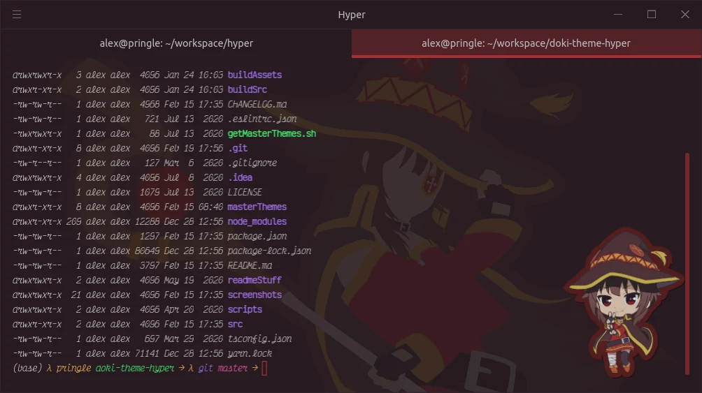
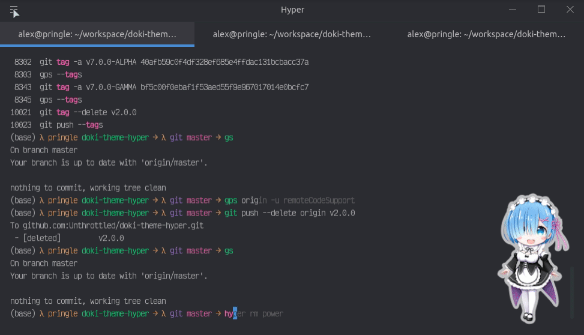

[](https://gitter.im/doki-theme-hyper/community?utm_source=badge&utm_medium=badge&utm_campaign=pr-badge)

# Feature Preview



## Screen Samples!

# [Complete Theme Album.](albums/complete_theme_album.md)

## Documentation

- [Installation](#installation)
- [Configuration](#configuration)
- [Preferences](#preferences)
  - [Background](#backgrounds) 
  - [System Match](#system-match)
- [About](#about)

## Installation

[You'll need hyper first!](https://hyper.is/#installation).
After you have hyper, you will need to make sure that hyper is in your path (you can find that in the plugins menu). Then all you need to run is

```
hyper i doki-theme-hyper
```

Be sure to restart hyper afterwards.

## Configuration

Stuff you can configure using the Hyper.js UI.



In the hamburger menu (Linux/Windows) or settings bar (MacoOS) there is a `Doki-Theme 
Settings` option with various options:

- **Themes**: Contains all themes you can decorate your Hyper.js term with.
- **Sticker Type**: Some themes have more than one sticker associated with the theme. This enables you to switch between the two.
- **Toggle Sticker**: This shows or hides the theme's sticker. It is defaulted to being on.
- **Toggle Fonts**: The current font family for the Doki-Theme is `Victor Mono`, this is a convenience option to apply that font family for you.
- **About Plugin**: Gives you the current version of the plugin.
- **View Changelog**: Opens your default browser to the changelog of Doki-Theme for Hyper.js.

### Suggestive Content

<div align="center">
    </img>
</div>

So I thought it was a good idea to add a bit of culture to this plugin.
<sup><sup>Ya boi is horny on main.</sup></sup>

I will give you a bit of a warning before you install suggestive content.
Some of us are professional Otaku, who want to remain, well...professional.
Don't worry if you choose to continue, I won't ask you again for that specific theme.

Applies for the following content:

- Rias Onyx: Secondary Content


## Preferences

Stuff you can configure using navigating to `Hyper` -> `Preferences`

If you want to be able to configure the opacity of the wallpaper used by your current theme(s), please add this to your hyper config.

### Backgrounds

The Doki Theme provides default opacity settings for each theme, which suites _my_ preferences.
However, if you want your background lighter or darker, feel free to use this config. 

### System Match

You have the ability to choose a light theme for when your system is in light mode, and a dark theme for when your system is in dark mode.

The expected value is the `Theme Name` which can be found in the dropdown.
However, here is a [list of all theme names](./themeList.md)

https://user-images.githubusercontent.com/15972415/163284686-7422488a-2705-4fda-8d0f-dadc6d677186.mp4

**Sample Config (.hyper.js)**

```javascript
module.exports = {
  config: {
    dokiSettings: {
      backgrounds: {
        dark: {
          opacity: 0.2 // default is 0.10
        },
        light: {
          opacity: 0.4 // default is 0.15
        }
      }
    },
    systemMatch: {
      enabled: true,
      lightTheme: 'Zero Two Light', // Best
      darkTheme: 'Zero Two Dark', // Girl
    }
  },
  // more stuff....
}
```

**Customizing CSS**

If you feel the need to slightly change your current theme's styles, you can add your valid CSS in the `css` property in the config file.

[This should give you an idea of the styles that need to be overridden.](https://github.com/doki-theme/doki-theme-hyper/blob/be29451f076e5904ad25b4d0639fe4d171292ea3/src/css.ts#L54)

[You can find your hyper config here](https://hyper.is/#cfg)

## About!

Cute themes based on cute anime characters. With over **60** themes, the one you like the best, is probably here.

You can choose themes based on characters from these various Anime, Manga, or Visual Novels:

<details>
  <summary>All Featured Titles</summary>

- AzurLane
- Blend S
- Charlotte
- Chuunibyou, Love, & Other Delusions
- Code Geass
- Daily Life with a Monster Girl
- DanganRonpa
- Doki-Doki Literature Club
- Don't Toy With Me, Miss Nagatoro
- Fate/Type-Moon
- Future Diary
- Gate
- Guilty Crown
- Haikyu!!
- High School DxD
- Jahy-sama Will Not Be Discouraged!
- Kakegurui
- Kill La Kill
- KonoSuba
- Love Live!
- Lucky Star
- Miss Kobayashi's Dragon Maid
- Monogatari
- NekoPara
- Neon Genesis Evangelion
- One Punch Man
- OreGairu
- Quintessential Quintuplets
- Re:Zero
- Rising of the Shield Hero
- Shokugeki no Soma
- Sewayaki Kitsune no Senko-san
- Steins Gate
- Sword Art Online
- That Time I Got Reincarnated as a Slime
- Toaru Majutsu no Index
- Yuru Camp

</details>

Sticker in the way?
No worries! You can configure them to be on or off at your leisure.


## Theme Requests

If you want your main squeeze to be featured in the Doki Theme suite, feel free to [submit a theme request](https://github.com/doki-theme/doki-master-theme/issues).

## Contributing

If you want to get your workstation set up to work on the plugin,
then you'll want to check out the [CONTRIBUTING.md](./CONTRIBUTING.md) for instructions on what is needed.

## Enjoying the plugin?

Great! I am glad you like it!

Be sure to ⭐ and share it with other weebs!

## Contributions?

I think your voice needs to be heard! You probably have good ideas, so feel free to submit your feedback as [an issue](https://github.com/doki-theme/doki-theme-hyper/issues/new).

Don't be afraid to reach out and join the [Gitter Community](https://gitter.im/doki-theme-hyper/community?utm_source=share-link&utm_medium=link&utm_campaign=share-link!)

## [Even more Doki-Theme!](https://doki-theme.unthrottled.io/products)

---
<div align="center">
    </img>
</div>
