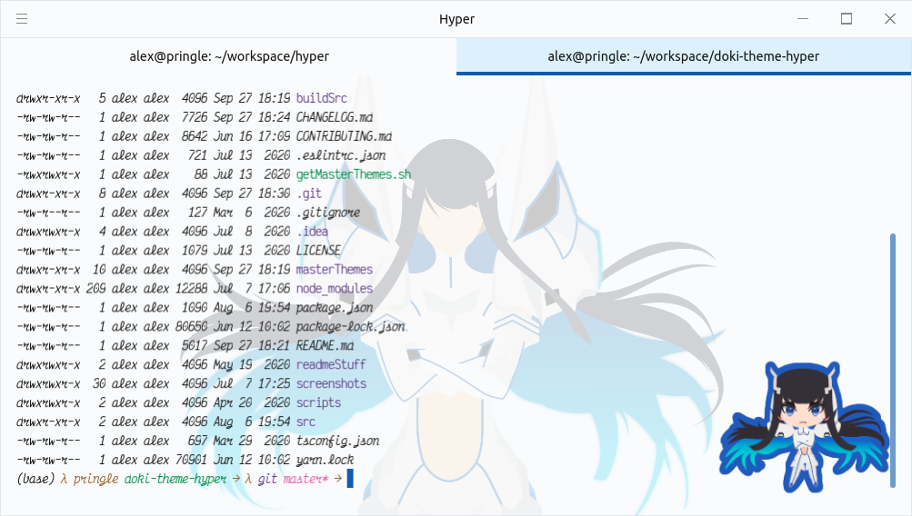

Re:Zero
---

### Emilia

### Rem

### Ram

### Beatrice

DanganRonpa
---

### Mioda Ibuki

Miscellaneous
---

### Hatsune Miku

KonoSuba
---

### Megumin

Kill La Kill
---

### Ryuko

### Satsuki

Doki-Doki Literature Club
---

## Just Monika
 
 
 
 ---
 #### Secondary
 
 
 
 ## Yuri
 
 
 
 ---
 #### Secondary
 
 
 
 ## Natsuki
 
 
 
 ---
 #### Secondary
 
 
 
 ## Sayori
 
 
 
 ---
 #### Secondary
 
 
